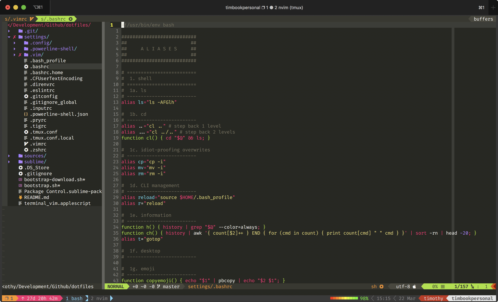
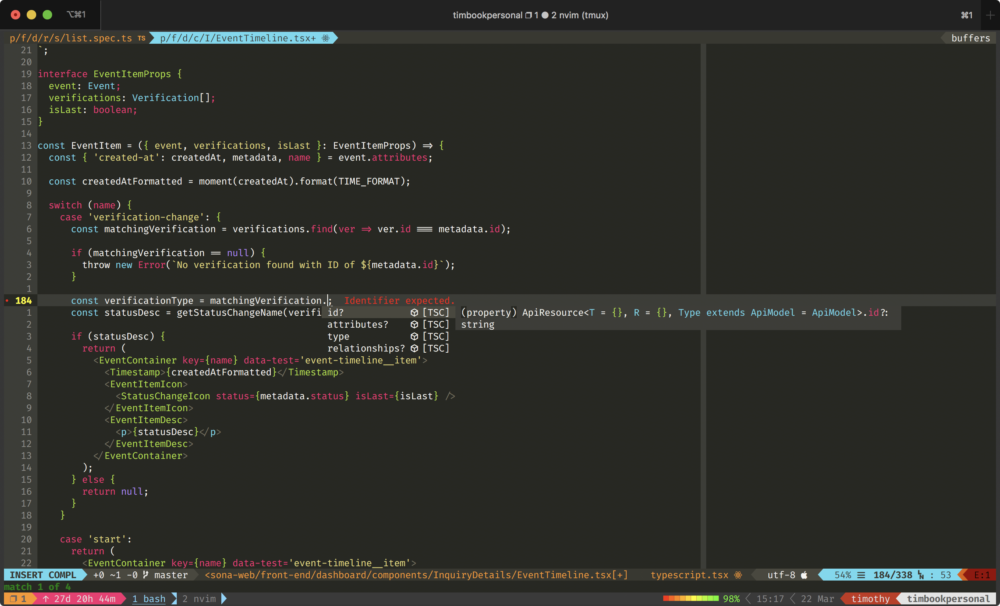
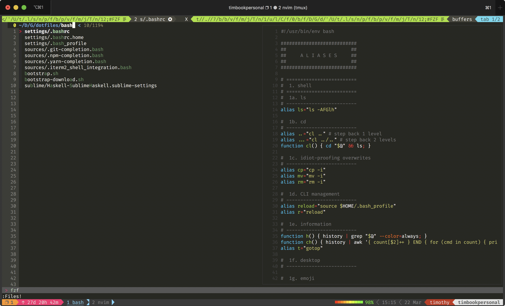
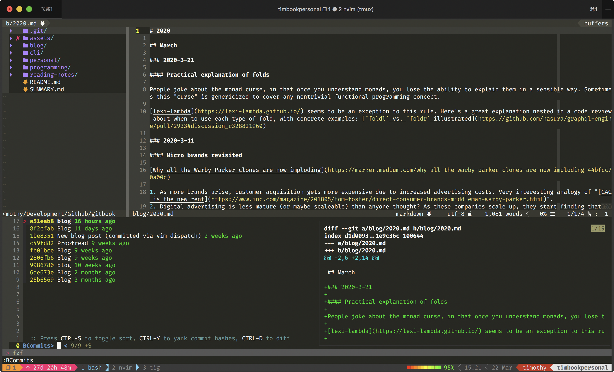
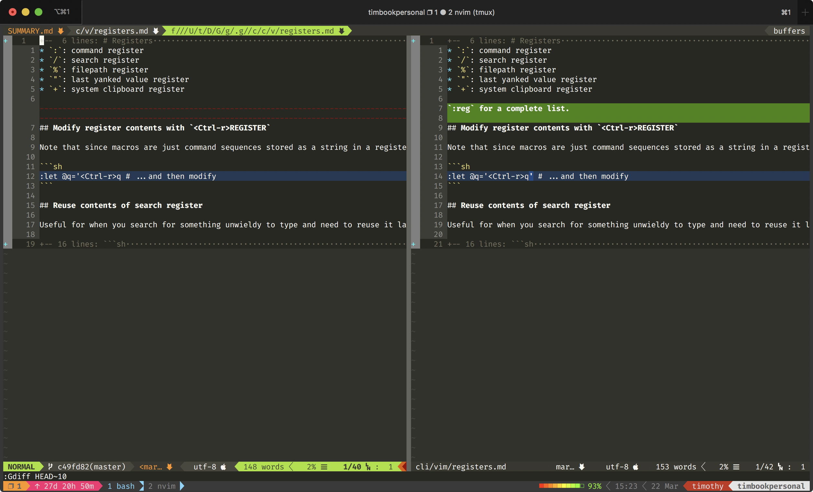
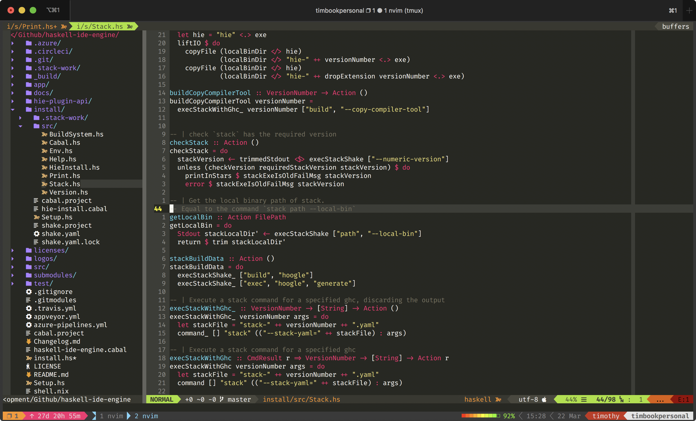
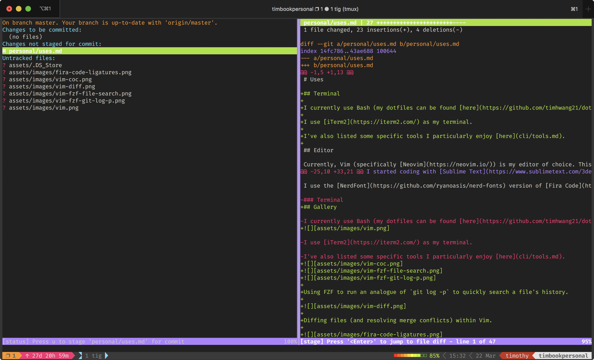

Dotfiles
=======









## Setup

**Note: for personal use. Don't blame me if this screws up your settings.**

```bash
git clone https://github.com/timhwang21/dotfiles.git
cd dotfiles
# Initial setup: install from brew, git, etc.
bin/bootstrap-download
# Install from local files
bin/bootstrap
```

## MacOS Applications

* Adobe
* Alfred 4
* Chrome
* Discord
* Divvy
* Docker
* Dropbox
* Fantastical
* Firefox
* GPG Keychain
* iTerm
* Lastpass
* Postman
* Slack
* Spotify
* Steam
* Sublime Text 3
* VLC

## Other manual steps

### SSH key

* Generate SSH key and add to `ssh-agent`
* Add key to sites that need it

## TODO

### LaTeX

Needed for Pandoc PDF export.

```sh
# first install BasicTeX - http://www.tug.org/mactex/morepackages.html
sudo tlmgr update --self
sudo tlmgr install collection-fontsrecommended
```
